# DevOps-With-Kubernetes

## Chapter 2

### Exercise 1.1: Getting started

**Submission:** [1.1](https://github.com/Asadullah378/DevOps-With-Kubernetes/tree/1.1)

**Log Output:**

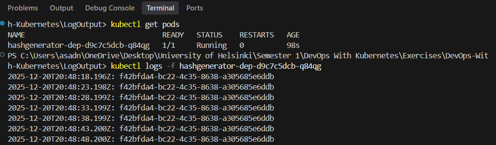

### Exercise 1.2: The project, step 1

**Submission:** [1.2](https://github.com/Asadullah378/DevOps-With-Kubernetes/tree/1.2)

**ToDo App:**

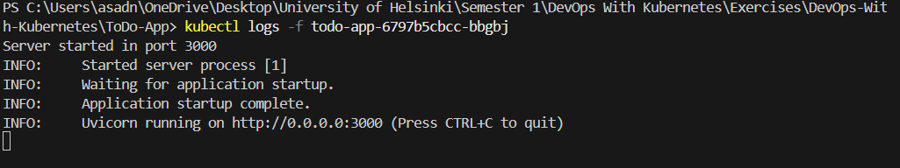

### Exercise 1.3: Declarative approach

**Submission:** [1.3](https://github.com/Asadullah378/DevOps-With-Kubernetes/tree/1.3)

**Log Output:**

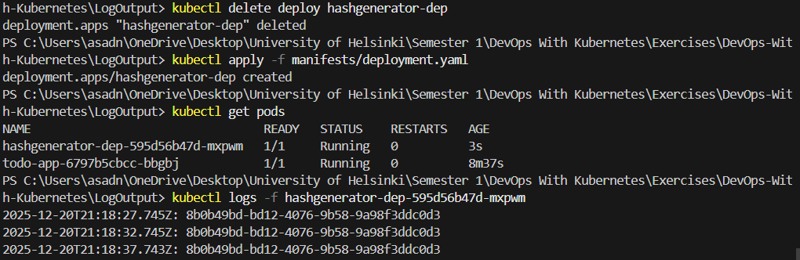

### Exercise 1.4: The project, step 2

**Submission:** [1.4](https://github.com/Asadullah378/DevOps-With-Kubernetes/tree/1.4)

### Exercise 1.5: The project, step 3

**Submission:** [1.5](https://github.com/Asadullah378/DevOps-With-Kubernetes/tree/1.5)

**ToDo App:**

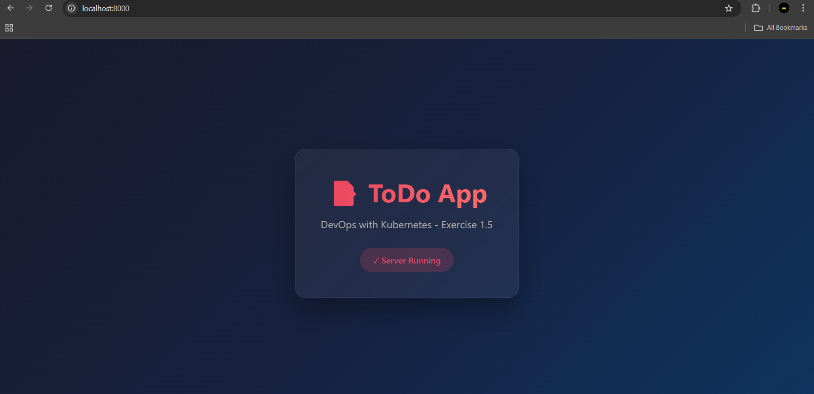

### Exercise 1.6: The project, step 4

**Submission:** [1.6](https://github.com/Asadullah378/DevOps-With-Kubernetes/tree/1.6)

**ToDo App:**

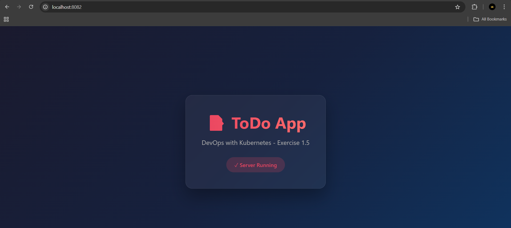

### Exercise 1.7: External access with Ingress

**Submission:** [1.7](https://github.com/Asadullah378/DevOps-With-Kubernetes/tree/1.7)

**Log Output:**

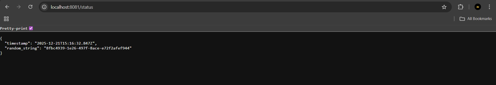

### Exercise 1.8: The project, step 5

**Submission:** [1.8](https://github.com/Asadullah378/DevOps-With-Kubernetes/tree/1.8)

**ToDo App:**

### Exercise 1.9: More services

**Submission:** [1.9](https://github.com/Asadullah378/DevOps-With-Kubernetes/tree/1.9)

**PingPong App:**

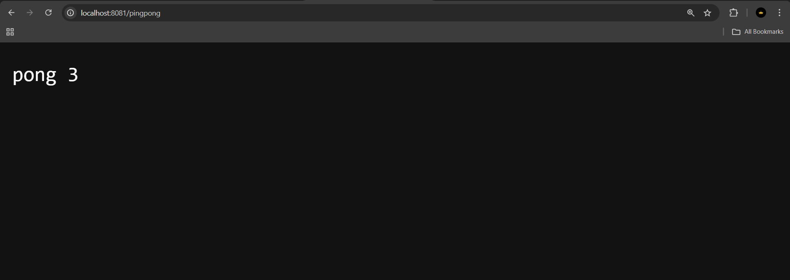

### Exercise 1.10: Even more services

**Submission:** [1.10](https://github.com/Asadullah378/DevOps-With-Kubernetes/tree/1.10)

**Log Output:**

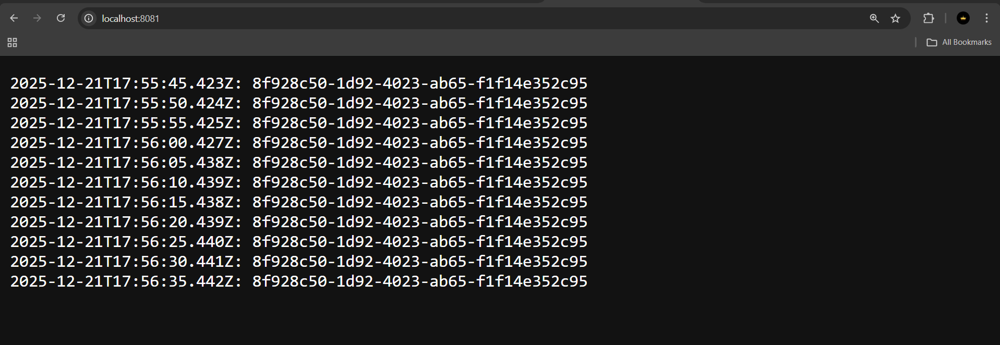

### Exercise 1.11: Persisting data

**Submission:** [1.11](https://github.com/Asadullah378/DevOps-With-Kubernetes/tree/1.11)

**Output:**

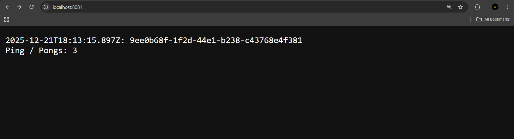
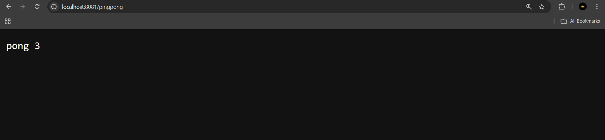

### Exercise 1.12: The project, step 6

**Submission:** [1.12](https://github.com/Asadullah378/DevOps-With-Kubernetes/tree/1.12)

**ToDo App:**

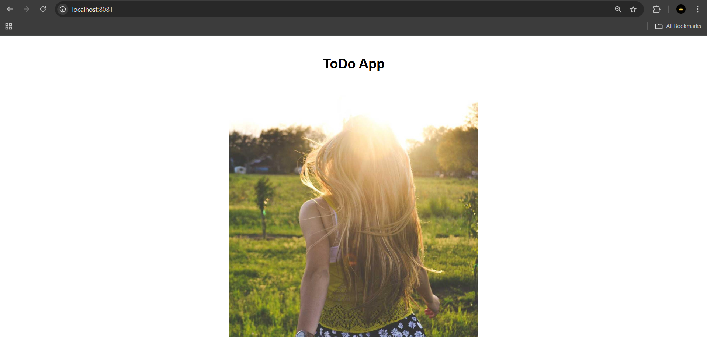

### Exercise 1.13: The project, step 7

**Submission:** [1.13](https://github.com/Asadullah378/DevOps-With-Kubernetes/tree/1.13)

**ToDo App:**

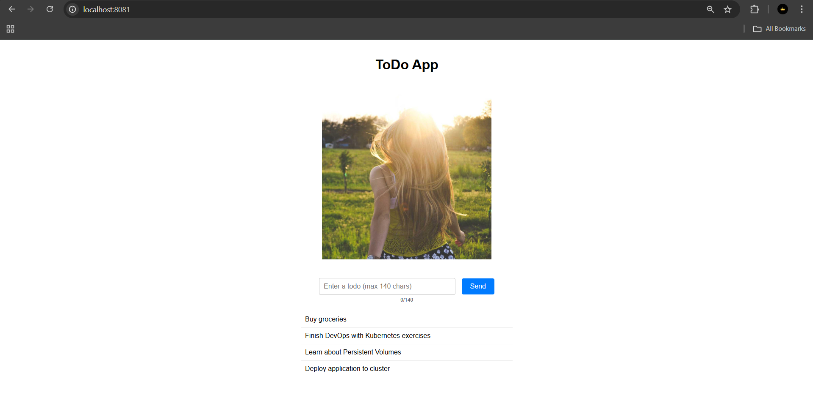

## Chapter 3

### Exercise 2.1: Connecting pods

**Submission:** [2.1](https://github.com/Asadullah378/DevOps-With-Kubernetes/tree/2.1)

### Exercise 2.2: The project, step 8

**Submission:** [2.2](https://github.com/Asadullah378/DevOps-With-Kubernetes/tree/2.2)

**ToDo App:**

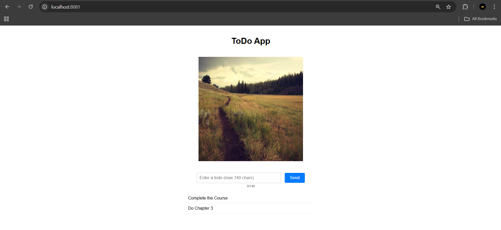

### Exercise 2.3: Keep them separated

**Submission:** [2.3](https://github.com/Asadullah378/DevOps-With-Kubernetes/tree/2.3)

### Exercise 2.4: The project, step 9

**Submission:** [2.4](https://github.com/Asadullah378/DevOps-With-Kubernetes/tree/2.4)

### Exercise 2.5: Documentation and ConfigMaps

**Submission:** [2.5](https://github.com/Asadullah378/DevOps-With-Kubernetes/tree/2.5)

**Log Output:**

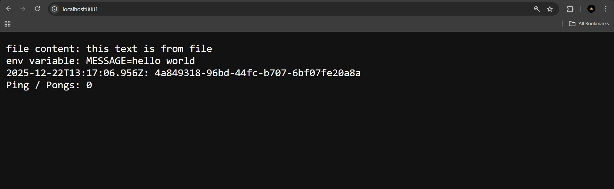

### Exercise 2.6: The project, step 10

**Submission:** [2.6](https://github.com/Asadullah378/DevOps-With-Kubernetes/tree/2.6)

### Exercise 2.7: Stateful applications

**Submission:** [2.7](https://github.com/Asadullah378/DevOps-With-Kubernetes/tree/2.7)

**Output:**

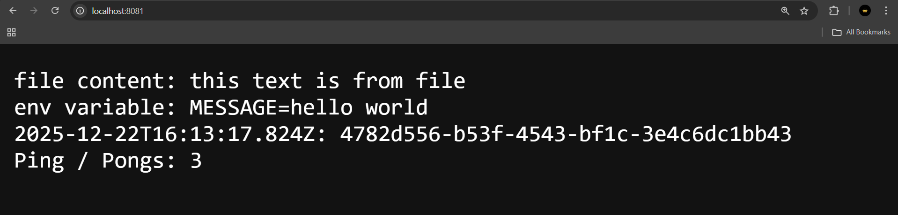
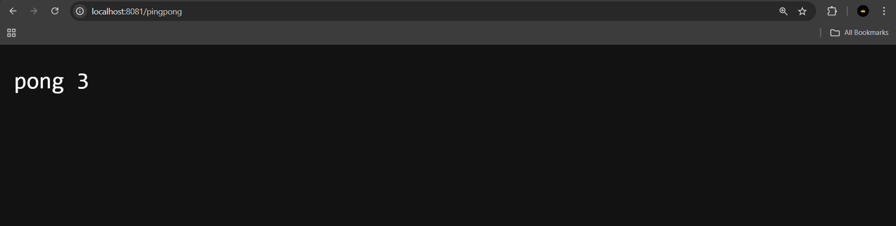

### Exercise 2.8: The project, step 11

**Submission:** [2.8](https://github.com/Asadullah378/DevOps-With-Kubernetes/tree/2.8)

**ToDo App:**

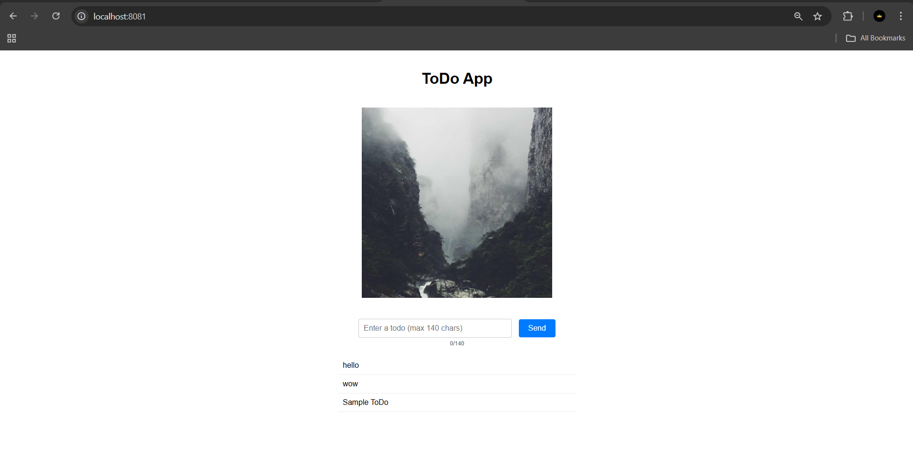

### Exercise 2.9: The project, step 12

**Submission:** [2.9](https://github.com/Asadullah378/DevOps-With-Kubernetes/tree/2.9)

**ToDo App:**

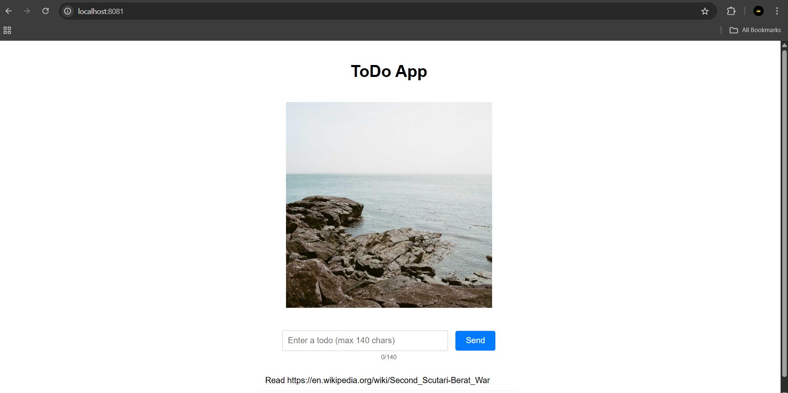
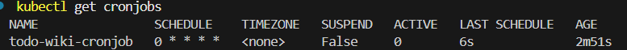

### Exercise 2.10: The project, step 13

**Submission:** [2.10](https://github.com/Asadullah378/DevOps-With-Kubernetes/tree/2.10)

**ToDo App:**

### Exercise 3.1: Pingpong GKE

**Submission:** [3.1](https://github.com/Asadullah378/DevOps-With-Kubernetes/tree/3.1)

**PingPong App:**

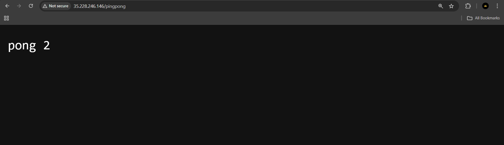

### Exercise 3.2: Back to Ingress

**Submission:** [3.2](https://github.com/Asadullah378/DevOps-With-Kubernetes/tree/3.2)

**PingPong App\LogOutput:**

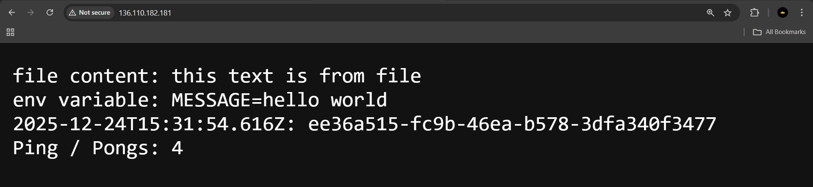
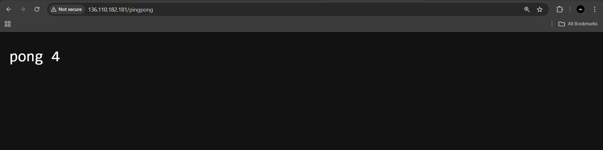

### Exercise 3.3: To the Gateway

**Submission:** [3.3](https://github.com/Asadullah378/DevOps-With-Kubernetes/tree/3.3)

### Exercise 3.4: Rewritten routing

**Submission:** [3.4](https://github.com/Asadullah378/DevOps-With-Kubernetes/tree/3.4)

### Exercise 3.5: The project, step 14

**Submission:** [3.5](https://github.com/Asadullah378/DevOps-With-Kubernetes/tree/3.5)

**ToDo App:**

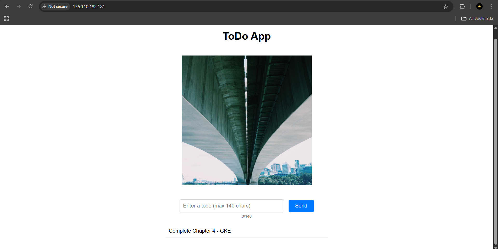

### Exercise 3.6: The project, step 15

**Submission:** [3.6](https://github.com/Asadullah378/DevOps-With-Kubernetes/tree/3.6)

**ToDo App:**

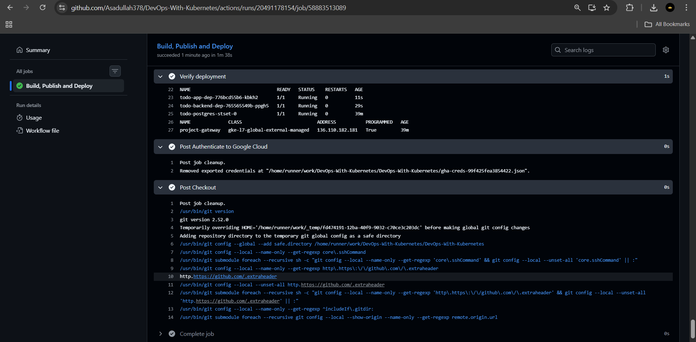

### Exercise 3.7: The project, step 16

**Submission:** [3.7](https://github.com/Asadullah378/DevOps-With-Kubernetes/tree/3.7)

### Exercise 3.8: The project, step 17

**Submission:** [3.8](https://github.com/Asadullah378/DevOps-With-Kubernetes/tree/3.8)

**ToDo App:**

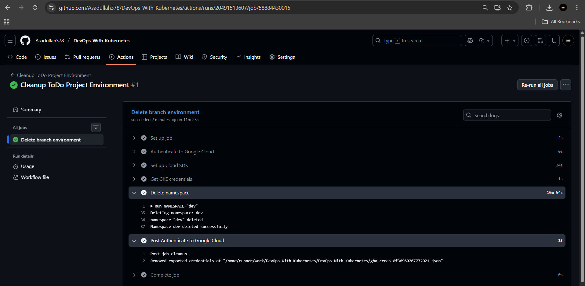

### Exercise 3.9: DBaaS vs DIY

**Submission:** [3.9](https://github.com/Asadullah378/DevOps-With-Kubernetes/tree/3.9)

#### Comparison: Database as a Service (DBaaS) vs DIY (Self-managed with PersistentVolumes)

| Aspect | DBaaS (e.g., Google Cloud SQL) | DIY (StatefulSet + PVC) |
|--------|-------------------------------|------------------------|
| **Initial Setup** | Quick - few clicks/commands in cloud console | More work - need to configure StatefulSet, PVC, secrets, services |
| **Cost** | Higher - pay for managed service premium | Lower - only pay for compute and storage resources |
| **Maintenance** | Minimal - provider handles patches, updates | Full responsibility - must manage updates, security patches |
| **Scaling** | Easy - usually just a slider/config change | Manual - need to understand StatefulSet scaling, may need to reconfigure |
| **Backups** | Automated - built-in scheduled backups, point-in-time recovery | Manual setup - need to configure CronJobs for pg_dump or use tools like Velero |
| **High Availability** | Built-in - automatic failover, replicas | Complex - must configure replication, failover manually |
| **Disaster Recovery** | Included - cross-region replication available | DIY - need to set up cross-region backup strategies |
| **Performance Tuning** | Limited - some parameters exposed | Full control - can tune all database parameters |
| **Vendor Lock-in** | Higher - tied to cloud provider's offering | Lower - portable across any Kubernetes cluster |
| **Learning Curve** | Lower - abstracted complexity | Higher - need to understand Kubernetes storage, StatefulSets |
| **Monitoring** | Included - built-in dashboards and alerts | DIY - need to set up Prometheus, Grafana, etc. |
| **Connection Security** | Managed - SSL/TLS configured automatically | Manual - need to configure certificates |

#### When to Choose DBaaS:
- Production workloads requiring high availability
- Teams without dedicated database expertise
- When time-to-market is critical
- Compliance requirements needing managed backups and audit logs

#### When to Choose DIY:
- Development/testing environments
- Cost-sensitive projects
- Need for full control over database configuration
- Multi-cloud or hybrid cloud strategies
- Learning and educational purposes